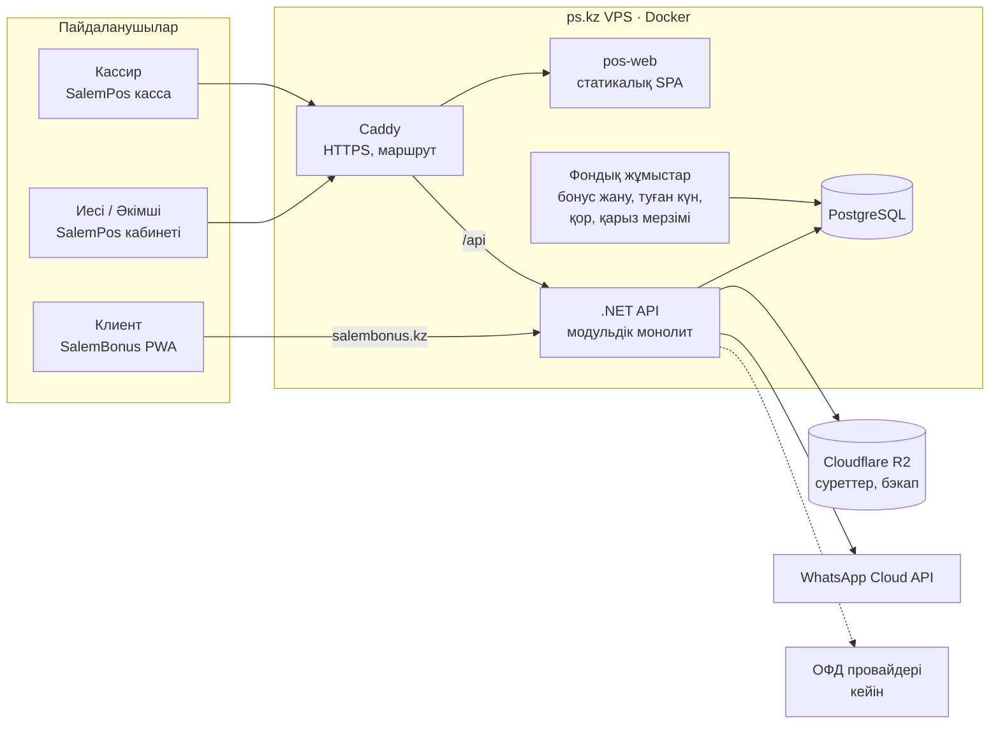
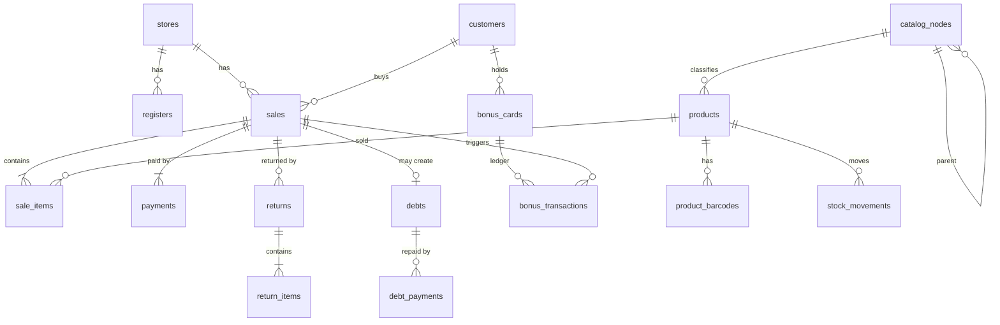
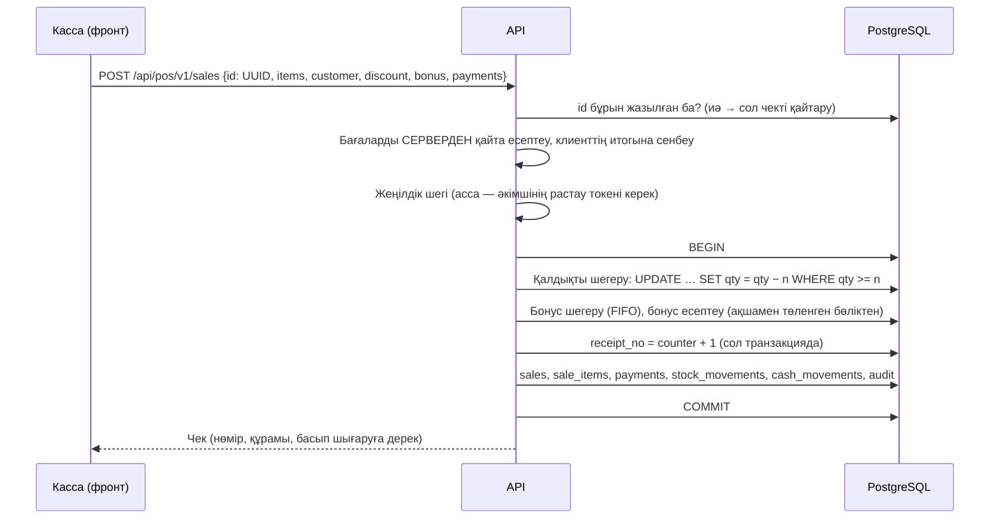

# SalemPos — архитектура және жоспар

Негізі: `ТЗ_Автозирация`, `ТЗ_Касса`, `ТЗ_Товар`, `ТЗ_Статистика` (23–26.09.2026), 13 дизайн-макет,
бөлімдер тізімі және Бонус бөлімінің тізімі. Бағдар — X2 POS деңгейіндегі касса + есеп жүйесі.

---

## 0. Қысқаша

- **SalemPos — SalemBonus бэкендінің жалғасы**, бөлек жоба емес. ТЗ-да жазылған: «Клиенты/бонусы
  SalemBonus используют общие данные». Сондықтан **бір дерекқор, бір .NET шешімі**, ішінде жаңа модульдер.
- Архитектура — **модульдік монолит**. Бір API процесі, модульдер папкамен бөлінген. Бір VPS-ке (4 ГБ)
  микросервистер сыймайды да, қажеті де жоқ.
- Фронт — **жаңа React қосымшасы** `pos/` папкасында, стек SalemBonus-пен бірдей.
- Сервер — **ps.kz VPS**. Render мен Neon-нан кетеміз: тегін Render 15 минуттан кейін ұйықтайды, оянуы
  30–50 секунд. Клиент кассада тұрғанда бұл мүмкін емес.
- **Онлайн-first, бірақ офлайнға дайын**: әр сатылымның идентификаторын касса өзі жасайды (UUID), сервер
  оны қайталанса да бір рет қана жазады. Кейін офлайн режим керек болса, архитектураны бұзбай қосамыз.
- Дерекқор — **PostgreSQL** (ТЗ-да MySQL аталған, бірақ SalemBonus қазір Postgres-те, ортақ дерек бір
  базада болуы керек).

---

## 1. ТЗ-да шешілмеген бес мәселе

Бұлар архитектураға тікелей әсер етеді.

**Шешілді (27.09.2026):**
- №1 — **тек онлайн**. Офлайн жасалмайды, бірақ сатылым UUID-і қалады (қайталанған сұраныстан қорғайды)
- №2 — **фискалдық чек әзірше жоқ**, кейін
- №3 — **жабдық әзірше жоқ**: сканер, принтер, терминал интеграциясы жасалмайды
- №5 — **тек ТЗ-сы бар модульдер жасалады**: Авторизация, Товар, Касса, Статистика. ТЗ-сы жоқ
  бөлімдер (Склад, Продажа, Финанс, Клиенты, Сотрудники, Настройка, Бонус) кейін
- Бәрі (бэкенд, екі фронт, база) **бір VPS-те**

| # | Мәселе | Неге маңызды | Болжам |
|---|---|---|---|
| 1 | **Интернет үзілсе касса жұмыс істей ме?** | X2 POS интернетсіз жұмыс істейді. Бірақ ТЗ-да «чек нөмірін сервер береді» деп жазылған — бұл офлайнмен сыйыспайды: интернетсіз сервер нөмір бере алмайды. | Онлайн. Офлайнға тек «ілгек» қалдырамыз (UUID, кезек). Офлайн керек болса — уақытша нөмір, синхрондағанда нақты нөмір. |
| 2 | **Фискалдық чек (ОФД)** | ТЗ-да мүлдем жоқ. Қазақстанда бөлшек саудада онлайн-ККМ қолдану міндетті (ерекшеліктері бар — **бухгалтермен растау керек**). Онсыз дүкен заң бұзады. | Бірінші нұсқа фискалсыз. Кейін Webkassa / ReKassa / ukassa API-мен интеграция — сатылым транзакциясына бір қадам қосылады. |
| 3 | **Жабдық** | Сканер, чек принтері, банк терминалы — әрқайсысы бөлек интеграция. | Браузердегі веб-қосымша. Сканер — «пернетақта» режимінде (USB/Bluetooth, баптауы жоқ). Чек — браузер арқылы 58/80 мм басып шығару. Терминал — кассир қолмен растайды. |
| 4 | **Домен** | ТЗ-да `salempos.kz`, бұрын `salemtech.kz` талқыладық. Cookie мен CORS соған байланады. | `salempos.kz` — касса мен кабинет, API сол доменнің `/api` жолында. |
| 5 | **ТЗ жоқ бөлімдер** | Склад–Поставщики, Продажа, Финанс, Клиенты, Сотрудники, Настройка — ТЗ жоқ. Бонус — тек тізім. | Касса мен Статистика ТЗ-ларында аталған сұраныстар бойынша минималды нұсқа. Толық ТЗ келгенде кеңейтеміз. |

---

## 1а. Платформа: Bonus, Pos, кейін Zapis

**Шешім (28.09.2026): микросервис емес — модульдік монолит, ортақ база, модуль сайын бөлек схема.**

```
core   — клиенттер, бизнес/дүкендер, қызметкерлер және кіру, аудит  (барлық өнімге ортақ)
bonus  — бонус карталары мен операциялары                          (SalemBonus)
pos    — тауар, қойма, сатылым, касса                              (SalemPos)
zapis  — қызметтер, шеберлер, жазылулар                            (SalemZapis, кейін)
```

Ережелер:
- Бір адам — бір клиент, бір бизнес — бір аккаунт, барлық өнімде ортақ
- Модуль басқа модульдің кестесіне тікелей жазбайды — тек Application-деңгейдегі интерфейс арқылы
  (мысалы, касса `ILoyaltyService` шақырады, бонус кестесіне өзі жазбайды)
- Қызметкер токені — `salem-staff` audience, барлық өнімге ортақ
- Бар бонус кестелері әзірге `public` схемасында; кейін бөлек миграциямен `bonus`-қа көшеді
- Бөлек сервиске шығару — бөлек команда келгенде немесе бір модульдің жүктемесі басқалардан
  әлдеқайда асқанда. Шекаралар сол үшін қазірден бөлек

Бір логин барлық өнімде жұмыс істеуі үшін өнімдер бір доменнің астында болғаны оңай
(`pos.salemtech.kz`, `zapis.salemtech.kz`). Әртүрлі түбір домендерде орталық кіру беті керек.

---

## 2. Жүйенің жалпы көрінісі



---

## 3. Репозиторий құрылымы

Шешімнің атын (`SalemBonus.*`) өзгертпейміз — ол жүздеген файлды қозғайды, пайдасы жоқ. Модульдер
әр жобаның ішінде папкамен бөлінеді:

```
backend/
  SalemBonus.Domain/
    Entities/            ← бар: Customer, BonusCard, Store…
    Pos/Tenancy/         ← Organization, StoreMembership, Register
    Pos/Staff/           ← StaffUser, роль, рұқсаттар
    Pos/Catalog/         ← CatalogNode, Product, Brand, Unit, Characteristic…
    Pos/Inventory/       ← Warehouse, StockBalance, StockMovement
    Pos/Purchasing/      ← Supplier, PurchaseReceipt, SupplierPayable
    Pos/Sales/           ← Sale, SaleItem, Payment, Return, Debt
    Pos/Cash/            ← CashMovement, Expense
    Pos/Audit/           ← AuditEntry
  SalemBonus.Application/Pos/<модуль>/   ← сервистер, DTO, валидация
  SalemBonus.Infrastructure/            ← EF конфигурация, репозиторийлер, R2, WhatsApp
  SalemBonus.Api/Controllers/Pos/       ← /api/pos/v1/…
frontend/   ← SalemBonus клиент PWA (бар)
pos/        ← SalemPos веб-қосымшасы (жаңа)
```

---

## 4. Бэкенд

### 4.1. Модульдер

| Модуль | Жауапкершілігі | ТЗ |
|---|---|---|
| **Tenancy** | Ұйым → дүкендер → кассалар; кім қай дүкенге кіре алады | Статистика §3.3 |
| **Staff & Auth** | Қызметкерлер, телефон+пароль, PIN, рөлдер, рұқсаттар | Авторизация, Касса §15, §18 |
| **Catalog** | Шексіз деңгейлі классификация, тауар, бренд, өлшем бірлігі, сипаттамалар, штрихкод, сурет | Товар |
| **Inventory** | Қоймалар, қалдық, қозғалыс журналы, ең аз қалдық | Товар §6.2, Статистика §15 |
| **Sales (іске асқаны — Касса 1-қадам)**
- `sales` + `sale_items` + `sale_payments`: баға, атау, бірлік сатылған сәттегі күйінде; жеңілдік пен
  бонус жолдарға үлес бойынша бөлінеді (`sale_items.discount`) — қайтарғанда клиент нақты төлегенін алады
- Чек нөмірі `receipt_counters` арқылы **дүкен ішінде сквозной** (барлық касса ортақ): бір SQL
  `INSERT … ON CONFLICT DO UPDATE … RETURNING`, транзакция ішінде жол бұғатталады; `(store_id, number)` бірегей
- Қайталап жіберу қорғанысы: касса әр себетке `client_request_id` береді, `(store_id, client_request_id)` бірегей
- Қалдық `FOR UPDATE` бұғатымен тексеріледі — соңғы дананы екі касса бір уақытта сата алмайды
- Бонус SalemBonus ережесімен (`BonusLedger`, терминал API-мен ортақ): шегеру FIFO, есептеу төленген
  сомадан, чек `receipt_id = sale.id`
- Касса cookie-і енді `/api/pos/v1` жолында (сатылым қай кассадан екенін біледі); ескісі автоматты көшеді
- **Қарыз** (`debts` + `debt_payments`): тек анықталған клиентке және `sales.debt` құқығымен; толық не
  аралас (қолма-қол + қарыз). Бонус тек нақты төленген бөліктен. Өтеу бөлшек/толық, әр өтеу — жеке жол
  (сома, түрі, кассир, қалдығы). **Кейін:** қарыз өтелгенде бонус есептеу (бизнес шешімі керек)
- **Қайтару** (`sale_returns` + `sale_return_items`): толық не бөлшек, әр позиция сатылғанынан аспайды;
  клиентке нақты төлегені (жеңілдік пен бонус үлесі шегеріліп, бүтін теңгемен). Қарызға сатылғанда алдымен
  ашық қарыз азаяды. Тауар қоймаға қайтады; шегерілген бонус қайтарылады (`ReturnRestore`), есептелгені
  алынады (`ReturnReversal`, теріс баланссыз). Екі рет басудан `client_request_id` қорғайды
- **Финанс** (`/cashier/finance`): кезеңдегі сатылым, төлем түрлері, аралас, жеңілдік, бонус, қайтарым,
  қарыз берілді/өтелді, түсім (сатылым − қайтарым), кассадағы қолма-қол. `finance.view` — бүкіл дүкен,
  әйтпесе тек өз сатылымдары
- **Баптаулар** дүкен деңгейінде (`store_cashier_settings`): төлем түрлері, аралас, автобасып шығару,
  электрондық чек, хабарламалар мен «аз қалды» шегі; касса атауы мен автобұғат — кассаның өзінде.
  Өзгерту — `settings.manage`, аудитке ескі/жаңа мәнімен. Реквизит өшірілмейді, жасырылады
- **Хабарламалар** (`store_notifications`): тек дерек сақталады (түрі, тауар/клиент, сома, чек, кассир),
  мәтінді интерфейс тілмен құрастырады. Қалдық шекті кесіп өткенде ғана (әр сатылымда емес)
- Npgsql: KeepAlive=30, ConnectionIdleLifetime=60 — Neon бос тұрғанда өлі қосылымдар 30 с «ілініп» қалмасын

**Purchasing** | Жеткізушілер, кіріс құжаттары, жеткізушіге қарыз | Статистика §15 |
| **Sales** | Сатылым, чек нөмірі, төлемдер, қайтару | Касса §7–13 |
| **Debts** | Клиент қарызы, ішінара/толық өтеу | Касса §11 |
| **Cash** | Қолма-қол қозғалысы, шығындар, «кассада болуы керек» | Статистика §10–11 |
| **Customers** | **Ортақ** клиенттер (SalemBonus-тың `Customer`) | Касса §4–5 |
| **Loyalty** | **Бар** бонус модулі: мәртебе, FIFO жану, есептеу/шегеру; + қайтару, туған күн, тарату | Бонус тізімі |
| **Statistics** | Бір агрегатты snapshot, барлық формулалар бір жерде | Статистика |
| **Audit** | Өзгермейтін әрекет журналы | Касса §16, Товар §20 |
| **Files** | R2-ге presigned жүктеу | Товар §6.5 |
| **Notifications** | Бар: қосымшадағы хабарлама; + WhatsApp | Авторизация §5–6 |

### 4.2. Көп дүкенділік

```
Organization (иесі, бизнес)
 ├─ Store (дүкен/филиал)  ← бар Store кестесі, SalemBonus серіктесі де осы
 │   ├─ Register (Касса №1, №2 …)
 │   ├─ Warehouse (қойма)
 │   └─ Sales, CashMovements, StockBalances …
 ├─ Catalog (тауарлар, санаттар, брендтер…)
 └─ StaffUser ↔ StoreMembership (роль + рұқсаттар әр дүкенге бөлек)
```

**ТЗ-дан бір ауытқу — растау керек.** ТЗ-да `products.store_id` жазылған. Мен каталогты **ұйым
деңгейінде** (`organization_id`) ұстауды ұсынамын, ал қалдық, баға, сатылым — **дүкен деңгейінде**.
Себебі: 3 филиалы бар иесі бір тауарды үш рет енгізбеуі керек. Бір дүкенді ұйым үшін айырмашылық жоқ.

Қауіпсіздік:
- Әр сұраныстың контексі (ұйым + белсенді дүкен) JWT-тен алынады, клиенттен келген `store_id`-ге сенбейміз
- EF Core **global query filter** — әр POS кестесіне автоматты `WHERE organization_id = …`
- Әр модульге «бөтен дүкеннің дерегін көре алмайды» деген интеграциялық тест

### 4.3. Аутентификация және рөлдер

**Қызметкер кіруі** (ТЗ Авторизация):
- Телефон + пароль. Пароль — `PasswordHasher` (PBKDF2), ашық күйде ешқашан сақталмайды
- Access JWT (15 мин) + айналмалы refresh токен **httpOnly cookie**-де. API мен фронт бір доменде
  (`salempos.kz/api`) болғандықтан CORS мен токенді `localStorage`-та ұстаудың қажеті жоқ
- Клиенттің JWT-і мен қызметкердің JWT-і **бөлек схема** (басқа audience) — клиент токенімен POS API-ге кіре алмайды
- Сәтсіз кіру шектеуі: телефон + IP бойынша rate limit, 5 қатеден кейін уақытша бұғат

**Парольді қалпына келтіру** — WhatsApp арқылы 4 таңбалы код:
- Код хештеліп сақталады, 5 мин жарамды, 5 әрекет, қайта жіберу 60 сек кейін
- WhatsApp Authentication шаблоны керек. **Тәуекел:** жаңа, верификациядан өтпеген аккаунтқа бұл санат
  бірден ашылмауы мүмкін. Сондықтан **SMS — қосалқы жол**, SMS-шлюз бәрібір керек

**Кассир ауысуы және PIN** (ТЗ Касса §15, §18):
- Касса (құрылғы) бір рет тіркеледі → құрылғы токенін алады
- Кассир тек **тіркелген құрылғыда** PIN-мен кіре алады. 4 таңба өздігінен әлсіз, сондықтан PIN ешқашан
  интернеттен тікелей кіру үшін қолданылмайды
- PIN қатесі: 5 рет → бұғат, әкімші ашады
- Автоблок (10 мин) — фронттағы жабын, ашу үшін PIN серверде тексеріледі, себет сақталады

**Рөлдер:** Иесі, Әкімші, Кассир + рұқсат жалаушалары:

| Рұқсат | Иесі | Әкімші | Кассир |
|---|:-:|:-:|:-:|
| Статистика, Финанс | ✓ | рұқсатпен | — |
| Тауар құру/өзгерту | ✓ | ✓ | рұқсатпен |
| Каталог құрылымы, архив | ✓ | ✓ | — |
| Сату | ✓ | ✓ | ✓ |
| Жеңілдік, шегінен асса | ✓ | ✓ | PIN-мен әкімші растайды |
| Қайтару | ✓ | ✓ | рұқсатпен |
| Қарызға сату | ✓ | ✓ | рұқсатпен |
| Минусқа сату | ✓ | баптауға сай | баптауға сай |
| Қызметкерлер, баптау | ✓ | рұқсатпен | — |

Барлық тыйым **серверде** тексеріледі (ASP.NET authorization policies), фронт тек батырманы жасырады.

### 4.4. Дерекқор моделі

Ақша — `numeric(14,2)`. Бонус — бүтін сан. Барлық кестеде `created_at`, `updated_at`.

**Tenancy / Staff**
- `organizations` (id, name, owner_staff_id, …)
- `stores` — **бар кесте**, қосылады: organization_id, kato_code (клиент тіркелгенде өңір осыдан),
  time_zone, logo_url, settings (jsonb: төлем түрлері, автоблок, чек баптауы)
- `registers` (id, store_id, name «Касса №1», device_token_hash, is_active)
- `staff_users` (id, phone уникалды, first/last_name, password_hash, pin_hash, language, status)
- `store_memberships` (staff_id, store_id, role, permissions jsonb, max_discount_percent)
- `staff_refresh_tokens`, `staff_otp_codes`

**Catalog** (ТЗ Товар §21)
- `catalog_nodes` (id, organization_id, parent_id, name, icon, image_url, description, status,
  sort_order, **path**) — бір кесте, `parent_id` арқылы шексіз деңгей. `path` (материалданған жол)
  екі нәрсеге керек: **цикл тексеру** (жаңа ата-ана өз ұрпағы болмауы керек) және **толық жолмен іздеу**
  («Автозапчасти → Тормозная система → Тормозные колодки»)
- `products` (id, organization_id, name, article, unit_id, brand_id, catalog_node_id, type, status,
  description, vat, is_marked, bonus_eligible, max_discount_percent, supplier_id, country, warranty, …)
- `product_barcodes` (product_id, barcode, is_primary) — **бір ұйымда бір штрихкод бір тауарға ғана**
- `product_images` (product_id, url, is_primary, sort_order) — файлы R2-де
- `brands`, `units`, `characteristic_definitions` (+ тізім мәндері), `product_characteristic_values`
- `price_types` + `product_prices` (store_id, product_id, price_type_id, price) — бөлшек/көтерме,
  макетте бар. **Қазір:** `product_prices` (product_id, store_id, sale_price, purchase_price) — баға түрі
  кейін. Каталог бизнеске ортақ, ал баға әр дүкенде өз. Кіріс бағасын кассир көрмейді
  (`products.edit` не `finance.view` керек)
- Сурет: браузер R2-ге қолтаңбалы PUT сілтемесімен тікелей жүктейді (түрі мен нақты көлемі
  қолтаңбаға кіреді, 5 МБ-қа дейін), алдын ала 1600px WebP-ке кішірейтеді. Сервер тек
  `org/{id}/products/` не `org/{id}/brands/` ішіндегі өз сілтемесін сақтайды.
  **Кейін:** тауардан алынған суреттерді R2-ден тазалайтын түнгі тапсырма
- Санатты архивтеу оның тармағындағы тауарларды да архивтейді (`products.archived_by_node_id`);
  қалпына келтіргенде тек солар қайтады, жеке архивтелген тауар архивте қалады (ТЗ §22.7)
- Импорт/экспорт — Excel (.xlsx, ClosedXML). Тауар ID → штрихкод → бірегей артикул бойынша
  табылады, әйтпесе жасалады. Алдымен «Тексеру» (ештеңе сақталмайды), сосын қате жолдар өткізіліп,
  қалғаны бір транзакцияда сақталады. Жоқ санат/бренд құқығы болса жасалады. Қалдық пен кіріс
  бағасы тек жаңа тауарға (бастапқы қоймалық жазба); кейінгісі — «Склад»

**Inventory**
- `warehouses` (store_id, name, is_default) — әр дүкенге «Основной склад» автоматты
- `stock_balances` (warehouse_id, product_id, quantity, avg_cost, min_quantity)
- `stock_movements` — **өзгермейтін журнал**: type (кіріс, сатылым, қайтару, түзету, ауыстыру),
  quantity ±, unit_cost, құжатқа сілтеме. Қалдық = журналдың қосындысы; `stock_balances` — жылдамдық
  үшін сақталған нәтиже

**Purchasing**
- `suppliers`, `purchase_receipts` + `purchase_receipt_items`, `supplier_payables` + өтеулер

**Sales**
- `sales` (id **UUID, касса жасайды**, store_id, register_id, cashier_id, **receipt_no**, customer_id,
  status, subtotal, discount, bonus_redeemed, total, created_at)
- `sale_items` (sale_id, product_id, **атауының көшірмесі**, quantity, price, discount,
  **cost_price көшірмесі**, **catalog_node_id көшірмесі**) — Статистика ТЗ §9, §10: тауардың бағасы
  немесе санаты кейін өзгерсе де, тарихи есеп дұрыс қалады
- `payments` (sale_id, method, amount, transfer_account_id, cash_given, change)
- `transfer_accounts` (store_id, bank, number, holder) — «Kaspi + нөмір + Максатбек»
- `returns` + `return_items` + қайтарылған төлем
- `debts` (customer_id, store_id, sale_id, amount, remaining, due_date, status) + `debt_payments`
- `store_receipt_counters` (store_id, next_no) — чек нөмірі

**Cash**
- `cash_movements` (store_id, register_id, type: сатылым, қайтым, шығын, инкассация, түзету, қарыз
  өтеу; amount, ref)
- `expenses` (store_id, category, amount, method, status)

**Customers / Loyalty** — **бар кестелер**
- `customers` (жаһандық), `bonus_cards` (клиент ↔ дүкен), `bonus_transactions` (FIFO партиялар)
- Қосылады: `bonus_transactions.sale_id` (қазіргі `ReceiptId` соған айналады), жаңа түрлер —
  `Reversal` (қайтарудағы кері есептеу), `Refund` (қайтарылған бонус), `Manual`

**Audit**
- `audit_log` (organization_id, store_id, actor_id, register_id, action, entity, entity_id,
  old jsonb, new jsonb, amount, result, ip, at) — тек қосылады, өзгерту/өшіру эндпоинті жоқ



### 4.5. Сатылым транзакциясы — жүйенің жүрегі

ТЗ Касса §20.7: «Атомарно создать чек, продажу, платеж, бонусные операции, изменение остатков и аудит».



Ережелер:
- **Идемпотенттік.** Интернет үзіліп, касса қайта жіберсе — бір сатылым екі рет жазылмайды
- **Сервер бағаны өзі есептейді.** Фронттан келген итогқа сенбейміз
- **Минусқа сату** баптауда қосылмаса, қалдық жетпегенде бүкіл транзакция кері қайтады
- **Чек нөмірі** — бір дүкен ішінде сквозной, `unique(store_id, receipt_no)`. Қатар сатылымда қайталанбайды
- **Аралас төлем** — әр бөлігі жеке `payments` жолы, қосындысы итогқа дәл тең болмаса — қабылданбайды
- Бонус **тек ақшамен төленген** бөліктен есептеледі (қазіргі SalemBonus ережесі сақталады)

Растау керек үш бизнес-ереже:
1. **Қарызға сатқанда бонус** — сатқанда ма, әлде қарыз өтелгенде ме? Ұсыныс: **өтелгенде**
2. **Қайтару кезінде бонус** — есептелген бонус пропорционалды кері алынады, жұмсалған бонус қайтарылады.
   Клиент бонусты әлдеқашан жұмсап қойса — баланс минусқа кете ме, әлде қайтарылатын ақшадан ұстала ма?
3. **Чек нөмірі** — әр дүкенге бөлек пе, әлде бүкіл ұйымға ортақ па? ТЗ-да «общий» деп тұр. Ұсыныс: **әр дүкенге бөлек**

### 4.6. Ортақ клиенттер және құпиялылық

Касса клиентті SalemBonus-тың жаһандық `customers` кестесінен іздейді. Мұнда бір қауіп бар:
кассир атымен іздей алса, **басқа дүкендердің клиенттерін** көріп қояды — біздің құпиялылық
саясатымызға қайшы («дүкен тек өзінің клиентін көреді»).

Шешімі:
- **Атымен іздеу** — тек осы дүкеннің клиенттері (бонус картасы барлар)
- **Телефонмен іздеу** — тек **толық нөмір** дәл сәйкес келсе, жаһандық базадан. Сатылым өткенде
  клиентке осы дүкеннің картасы автоматты ашылады (қазіргі POS логикасы да солай)
- Клиентті кассада тіркеу: аты, тегі, туған күні міндетті; өңір — **дүкеннің КАТО кодынан**
  (КАТО бізде бар). Кейін клиент сол нөмірмен SalemBonus-қа кірсе, картасын бірден көреді

### 4.7. API

- Префикс: `/api/pos/v1/…` (клиенттің API-і `/api/…` қалпында)
- Қателер — RFC 7807, мәтіні пайдаланушының тілінде (қазіргі `Accept-Language` механизмі)
- Тізімдер — беттеу + сүзгі + іздеу; ақшаға қатысты өзгерістер — идемпотенттік кілтпен
- Қазіргі `X-Store-Api-Key` POS эндпоинті жаңа жүйемен ауыстырылады (сыртқы интеграция әзірге жоқ)

Негізгі топтар: `auth`, `staff`, `stores`, `registers`, `catalog/nodes`, `products`, `brands`, `units`,
`characteristics`, `stock`, `suppliers`, `purchases`, `sales`, `returns`, `debts`, `cash`, `expenses`,
`customers`, `bonus`, `dashboard/statistics`, `audit`, `files/presign`.

### 4.8. Статистика

- Бір эндпоинт: `GET /api/pos/v1/dashboard/statistics?store_id&date_from&date_to&comparison` → бір snapshot
- **Барлық формула бір сервисте** (`BusinessMetrics`): выручка, себестоимость, прибыль, касса, бонус.
  Dashboard, Касса→Финансы, Продажа, Финанс — бәрі соны шақырады (ТЗ Статистика §26)
- Тәулік шекарасы — дүкеннің уақыт белдеуі бойынша
- Бастапқыда тікелей `sales` кестелерінен, индекстермен. Жылдамдық жетпесе — күндік агрегат кестесі

### 4.9. Фондық жұмыстар

Бар: бонус жану (`BonusExpiryWorker`). Қосылады:
- Туған күн бонусы (Бонус бөлімі) — күнде, дүкеннің баптауы бойынша сома мен мерзім
- Қалдық аз / тауар бітті хабарламасы
- Қарыз мерзімі жақындады
- Түнгі бэкап: `pg_dump` → R2, 30 күн сақтау

---

## 5. Фронтенд (`pos/`)

Стек SalemBonus-пен бірдей: React 19, Vite, TypeScript, Tailwind v4, React Router, TanStack Query,
Zustand. Бірдей стек — бір адам екеуін де ұстай алады.

- **Қабық:** қара сол жақ мәзір (10 бөлім), жоғарғы панель — дүкен таңдау, күн, хабарлама, профиль
- **Бастапқы бет рөлге қарай:** иесі → Статистика, кассир → Касса (ТЗ Статистика §3)
- **Тіл:** орысша негізгі, қазақша қосымша (ТЗ Авторизация §15). SalemBonus-та керісінше — қазақша негізгі
- **Бөлім = папка:** `features/cashier`, `features/catalog`, `features/stats` …

Касса экранына ерекше талап:
- **Жылдамдық.** Каталог ашылғанда бір рет жүктеліп, браузер жадында сақталады — іздеу мен сканерлеу
  серверді күтпейді
- **Сканер** — пернетақта сияқты жұмыс істейді: жылдам енгізу + Enter → штрихкод деп танимыз
- **Себет** браузерде сақталады: кассир ауысса, экран бұғатталса, бет жаңарса — жоғалмайды
- **Чек басып шығару** — 58/80 мм HTML үлгі + `window.print()`. Диалогсыз басу үшін кейін кішкене
  локал агент (QZ Tray сияқты) керек болады

---

## 6. Инфрақұрылым

VPS-те Docker Compose (қазіргі `docker-compose.prod.yml` негізінде):

| Контейнер | Не |
|---|---|
| caddy | HTTPS, `salempos.kz` → pos-web, `/api` → api; `api.salembonus.kz` → api |
| postgres | PostgreSQL 16, сыртқа ашылмайды |
| api | .NET API + фондық жұмыстар |
| pos-web | SalemPos статикасы |

SalemBonus PWA Cloudflare-де қала береді.

Көшу реті: VPS дайындау → `pg_dump` Neon-нан → VPS-ке қалпына келтіру → DNS ауыстыру → Render-ді
өшіру. Бір түнгі терезе жеткілікті.

Мониторинг: `/health` + UptimeRobot, контейнер логтары, бэкаптың күнделікті сәтті өткенін тексеру.

**Продакшнға шығар алдында міндетті (разработка кезінде ашылып қалған кілттер):**
- R2: `salem-api-dev` токенін өшіру — оның рұқсаты барлық бакетке (`medkurs` қоса) және кілттері
  чатқа түскен. Продакшнға тек `salem-media`-ға шектелген жаңа токен
- R2: `salem-media` бакетіне CORS және өз домені (`cdn.salempos.kz`); `r2.dev` сілтемесі тек девке
- Neon / Postgres паролін ауыстыру (бұрын чатқа түскен)
- `Auth__StaticOtpCode` алып тастау, нақты SMS/WhatsApp қосу

---

## 7. Кезеңдер

Реті тәуелділікке қарай: касса тауарсыз, тауар қоймасыз, бәрі қызметкерсіз жұмыс істемейді.

**Қолданыс аясы:** тек ТЗ-сы бар модульдер. Бірақ ТЗ-сы бар модульдер кейбір басқа бөлімдердің
**деректерін** талап етеді — олардың тек бэкенд бөлігі жасалады, жеке бөлім (интерфейс) жасалмайды:

| ТЗ-да не талап етілген | Қай бөлімнің дерегі | Не жасаймыз |
|---|---|---|
| Касса: «остатка недостаточно — ошибка» | Склад | Қалдық пен қозғалыс журналы, интерфейссіз. Қалдық тауар формасындағы «Остатки и цены» арқылы енгізіледі (ТЗ Товар §6.2) |
| Касса: кассирлер тізімі, PIN | Сотрудники | Иесіне арналған ең қарапайым «кассир қосу» формасы Касса баптауларында |
| Касса: клиент карточкасы, қарыз | Клиенты | Касса ішіндегі карточка ғана (ТЗ Касса §5) |
| Касса: төлем түрлері, аударым реквизиттері | Настройка | Касса баптаулары ішінде (ТЗ Касса §17) |
| Статистика: шығындар, жеткізушілер | Финанс, Склад | Дерегі жоқ блоктар «0» немесе көрсетілмейді |

Кезеңдер 5 және 6 — ТЗ келгенше тоқтатылды.

| # | Кезең | Не кіреді | Көлемі |
|---|---|---|---|
| 0 | **Негіз** | VPS-ке көшу, бэкап; ұйым, дүкен, касса; қызметкерлер, кіру, WhatsApp арқылы қалпына келтіру, PIN; рөлдер; аудит; `pos/` қабығы, тіл | L |
| 1 | **Товар** | ТЗ Товар толық: 6 вкладка, шексіз классификация, жолмен іздеу, тауар формасы (6 бөлім), штрихкод, сурет R2-ге, архив, ауыстыру | L |
| 2 | **Склад (минимум)** | Қойма, қалдық, қозғалыс журналы, бастапқы қалдық, кіріс құжаты, жеткізушілер | M |
| 3 | **Касса** | ТЗ Касса толық: сатылым, 6 төлем түрі, клиент іздеу/тіркеу, бонус, жеңілдік, чектер, қайтару, қарыз, кассир ауысуы, бұғат, күндік финанс, басып шығару | XL |
| 4 | **Статистика** | ТЗ Статистика толық: бір snapshot, 6 KPI, графиктер, финанс итогы, касса, топ тауар, клиенттер, бонус, «Требует внимания» | M |
| 5 | **Қалған бөлімдер** | Продажа, Финанс (шығындар, кассалық есеп), Клиенты (карточка, қарыз), Сотрудники, Настройка | L |
| 6 | **Бонус бөлімі** | Мәртебелер, жану мерзімі, туған күн бонусы, тарату (SalemBonus чатына), статистика + топ-10, карта дизайны | M |
| 7 | **Кейін** | Фискализация (ОФД), офлайн режим, банк терминалы, импорт/экспорт, мобильді нұсқа | — |

Бонус бөлімінің жартысы бізде дайын: мәртебе баспалдағы (`StoreLevel`), жану мерзімі (`BonusLifetimeDays`),
карта түсі (`ThemeColor`), дүкенмен жазысу (SalemBonus чаты). Тек басқару интерфейсі керек.

---

## 8. Жауап керек сұрақтар

~~1. Интернетсіз жұмыс~~ — тек онлайн · ~~2. Фискалдық чек~~ — кейін · ~~3. Жабдық~~ — жоқ ·
~~10. ТЗ жоқ бөлімдер~~ — кейін

**Касса кезеңіне (3) дейін:**
4. Қарызға сатқанда бонус қашан есептеледі? (4.5)
5. Қайтаруда клиент бонусты жұмсап қойса не болады? (4.5)
6. Чек нөмірі әр дүкенге бөлек пе, ортақ па? (4.5)
7. Кассирдің жеңілдік шегі — қанша %, әр кассирге бөлек пе?

**Негіз кезеңіне (0) дейін:**
8. Домен: `salempos.kz` па? (№4)
9. Каталог ұйым деңгейінде ме, дүкен деңгейінде ме? (4.2)
